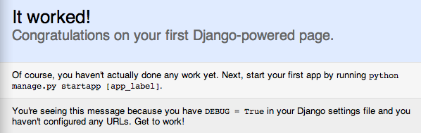
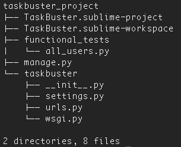

Часть I – Рабочая среда и начало проекта Django
===============================================
Создание хорошей рабочей среды очень важно для вашей производительности.
Может быть, это займет некоторое время, для того чтобы настроить ее,
но когда это хорошо сделано - то стоит потраченного времени!

Например, виртуальная среда поможет вам держать ваши пакеты организованными и контролируемыми,
а хороший текстовый редактор поможет вам с именами переменных, методами пакетов, подсветкой синтаксиса.

Да, и если вы не читали введение, этот Django учебник в актуальном состоянии.

Мы будем использовать Django 1.8 и Python 3. Это не означает, что вы не можете
следовать учебнику, если вы используете старую версию.
Это означает только то, что вам придется самим находить и устранять, возникающие ошибки,
чтобы решить проблемы, которые я не могу здесь предвидеть.

.. role:: red
.. role:: redbold
.. role:: bolditalic
.. role:: orange

Создание вашей рабочей среды
----------------------------

Для того, чтобы следовать этому Django учебнику вам понадобится :red:`Python3`,
менеджер пакетов :red:`pip3` и следующие пакеты: :red:`virtualenv` и :red:`virtualenvwrapper`.

       Комплект инструментов TaskBuster: Python3, pip3,
       virtualenv, virtualenvwrapper, Git и Sublime Text

Если вы используете Mac OS X вы можете посмотреть этот пост:
`Установить Python 3 на Mac OS X и использовать virtualenv и virtualenvwrapper <http://www.marinamele.com/2014/07/install-python3-on-mac-os-x-and-use-virtualenv-and-virtualenvwrapper.html/>`_

Вам также понадобится хороший текстовый редактор для управления всеми файлами
Django, которые мы будем создавать.
Я рекомендую Sublime Text, но если вы чувствуете себя комфортно с другим
текстовым редактором - то вперед!
Смотрите здесь:
`как установить и настроить Sublime Text 3 для Django. <http://www.marinamele.com/2014/03/install-and-configure-sublime-text-3.html/>`_

Несмотря на то, что мы будем говорить об этом в следующем посте, нам будет нужен Git,
система управления пакетами.
Если более чем один пользователь будет управлять кодом, то я рекомендую вам использовать
Git репозиторий, такие как `GitHub`_ или `Bitbucket`_ (последний из которых предлагает
частные репозитории для бесплатных аккаунтов). Вы можете узнать основы о системе Git по этой ссылке
`Git Tutorial.`_

.. _GitHub: https://github.com/
.. _Bitbucket: https://bitbucket.org/
.. _Git Tutorial.: http://www.marinamele.com/2014/07/git-tutorial-create-a-repository-commit-git-branches-and-bitbucket.html

Хорошо, теперь мы готовы начать наш супер-крутой проект Django |смайл|

Установка Django 1.8
--------------------

Во-первых, мы создадим виртуальную среду с :red:`Python3`, по умолчанию как Python.
В вашем терминале, введите:

.. code-block:: console

    $ which python3

чтобы узнать ваш путь к :red:`python3`. В моем случае это было ``/usr/local/bin/python3``. Далее,
создайте виртуальную среду для разработки, и укажите Python3 как Python по умолчанию
(напомню, что с virtualenvwrapper виртуальные среды создаются в папке
:red:`~/.virtualenvs`, независимо от рабочей папки):

.. code-block:: console

    $ mkvirtualenv --python=/usr/local/bin/python3 tb_dev

Измените свой путь к Python, если он отличается от моего, а также измените имя
виртуальной среды :red:`tb_dev` на другой, если хотите.
Вы увидите, что эта виртуальная среда теперь активна - командная оболочка
будет выглядить как то так: ``(tb_dev)[user@host]$``.

Вы можете отключить виртуальную среду написав:

.. code-block:: console

    $ deactivate

и активировать заново так:

.. code-block:: console

    $ workon tb_dev

Обратите внимание, что если вы работаете в этой среде, когда вы вводите :red:`python`
вы активируете :red:`python3`, и при вызове :red:`pip`, вы вызываете версию python3,
:red:`pip3`. Круто!

Готовы установить последнюю версию Django?! С активным tb_dev, введите:

.. code-block:: console

    $ pip install Django==1.8.14

Примечание: Вы можете проверить, есть ли новая версия, доступная `здесь <https://www.djangoproject.com/download//>`_.

Рабочий каталог и Sublime Text
------------------------------

Создайте новую папку на вашем компьютере, названную :red:`taskbuster_project`:

.. code-block:: console

    $ mkdir taskbuster_project

Эта папка будет главной папкой, содержащей Ваш проект Django, всю его
документацию, файлы развертывания, файлы управления версиями,
файлы sublime проекта, функциональные тесты и т.д.

Давайте создадим Sublime Text проект для управления всеми файлами внутри этой
папки (или с помощью своего редактора). Здесь, я буду считать, что вы активировали
`subl command`_ для открытия файлов с помощью терминала:

.. _subl command: http://www.marinamele.com/2014/03/install-and-configure-sublime-text-3.html

.. code-block:: console

    $ subl taskbuster_project

Эта команда откроет все файлы в папке :red:`tastbuster_project`.
Затем перейдите в главное меню и выберите :red:`Project / Save Project As`
(Проект / Сохранить Проект Как), имя вашего проекта как
:red:`TaskBuster.sublime-project`, и сохраните файл в той же папке
:red:`taskbuster_project` (по умолчанию это главная папка).

Теперь, вы будете видеть два различных файла в папке :red:`taskbuster_project`:
:red:`TaskBuster.sublime-project` и :red:`TaskBuster.sublime-workspace`
(Примечание: последний не отображается в редакторе sublime, но он есть в терминале).

Повинуйтесь козе тестирования
-----------------------------

Я читаю невероятную книгу:
`Test-Driven development with Python <http://www.obeythetestinggoat.com/>`_,
(Разработка через тестирование с помощью Python)
Гарри Дж.В. Персиваля (Harry J.W. Percival). И в ней говорится, что вы должны
подчиняться козе тестирования (:redbold:`Testing Goat`) — небольшому голосу в вашей
голове, которая говорит вам писать тест, прежде чем написать код.
:bolditalic:`Сначала тест, Сначала тест!`

       Повинуйтесь козе тестирования.
       Сначала тест, Сначала тест!

И это то, что мы будем делать здесь, перед созданием любого проекта Django…

Мы знаем, что, когда мы успешно создаем проект, мы получаем обычную синюю страницу Django:
:bolditalic:`It worked!` ("Все заработало"), когда мы направляемся по ссылке :red:`http://127.0.0.1:8000`.
Если мы изучим эту страницу, то увидим, что в ее головной части, тег заголовка title
имеет такой вид: ``<title>Welcome to Django</title>``. Я знаю, вы не можете видеть это,
потому что вы еще не создавали ни одного проекта! Вам придется сейчас доверять мне |смайл|

Так давайте напишем тест, который утверждает, что когда мы переходим по адресу
:red:`http://127.0.0.1:8000` мы получаем страницу с :bolditalic:`Welcome to Django`
(Добро пожаловать в Джанго) в его названии. Конечно, этот тест потерпит неудачу,
потому что у нас еще нет определенного проекта! Но это как раз то, о чем мы говорили:
создаем свой тест сначала, а затем код.

Во-первых, мы создадим еще одну виртуальную среду для тестирования, с Django 1.8 в нем:

.. code-block:: console

    $ mkvirtualenv --python=/usr/local/bin/python3 tb_test
    $ pip install Django==1.8.14

Далее, для того, чтобы имитировать работу браузера для нашего тестирования,
мы будем использовать пакет :red:`Selenium` (перед его установкой вам нужно будет иметь браузер Firefox):

.. code-block:: console

    $ pip install --upgrade selenium

Перейдите в папку :red:`taskbuster_project` и создайте папку для **функциональных тестов**.
Эта папка будет содержать все файлы, которые
**проверяют функциональность проекта с точки зрения пользователя.**
Создайте также файл :red:`all_users.py` в нем:

.. code-block:: console

    $ cd taskbuster_project
    $ mkdir functional_tests # создаем папку функциональных тестов
    $ cd functional_tests
    $ touch all_users.py

Откройте этот файл с помощью вашего редактора и напишите в нем:

.. code-block:: python
    :linenos:

    # -*- coding: utf-8 -*-
    from selenium import webdriver
    import unittest

    class NewVisitorTest(unittest.TestCase):

        def setUp(self):
            self.browser = webdriver.Firefox()
            self.browser.implicitly_wait(3)

        def tearDown(self):
            self.browser.quit()

        def test_it_worked(self):
            self.browser.get('http://localhost:8000')
            self.assertIn('Welcome to Django', self.browser.title)

    if __name__ == '__main__':
        unittest.main(warnings='ignore')

Давайте проанализируем этот код шаг за шагом:

* Первая строка указывает кодировку файла
* Затем импортируется модули :orange:`selenium` и :orange:`unittest` - библиотека Python для тестирования
* Далее создается класс :orange:`TestCase`, с именем :orange:`NewVisitorTest`, в котором:
    * метод :orange:`setUp` который иниализирует тест. Он открывает браузер и ждет 3 секунды, при необходимости.(если страница не загружена).
    * метод :orange:`tearDown`, который запускается после каждого теста. Он закрывает браузер.
    * метод, который начинается со слова test (тест), он утверждает, что заголовок веб-страницы имеет такой вид: :bolditalic:`Welcome to Django`.
* Методы :orange:`setUp` и :orange:`tearDown` выполняются в начале и в конце каждого метода теста (те, которые начинаются со слова test).
* Последние строки означают, что Python выполнит функцию :orange:`unittest.main()` только тогда, когда файл запускается напрямую (не импортируется). Эта функция запускает :red:`исполнителя тестов unittest (Test runner)`, который идентифицирует различные тесты, отбирая методы, которые начинаются со слова test.
* Мы вызываем функцию :orange:`unittest.main()` с дополнительными параметрами :orange:`warnings=’ignore’` (предупреждения = 'игнорировать'), чтобы избежать сообщения ResourceWarning.

Давайте запустим этот скрипт:

.. code-block:: console

    $ python all_users.py

Результат показывает, как тестирование, очевидно, терпит неудачу. Вы увидите что-то подобное

.. code-block:: console

    FAIL: test_it_worked (__main__.NewVisitorTest)

и :red:`AssertionError` с сообщением :bolditalic:`Welcome to Django` не найдено.

Итак, давайте создадим проект Django и сделаем так, чтобы этот тест прошел!

Создаем проект Django
---------------------

Зайдите внутрь папки :red:`taskbuster_project` и наберите:

.. code-block:: console

    $ django-admin.py startproject taskbuster .

Обратите внимание на точку в конце команды, это создаст проект taskbuster,
не создавая дополнительных папок.
(Точка крайне важна, потому что это говорит скрипту устанавливать проект Django
в вашем текущем каталоге, который и обозначается сокращённо точкой ``.``)
Текущая структура вашей главной папки должна быть:

Примечание: это изображение показывает вывод моего терминала при использовании древовидной команды
(tree command). Если Вы хотите использовать его, вам, вероятно, придется сначала его установить.

Как вы видите, мы создали:

* файл :red:`manage.py`, используемый для управления сервером разработки, миграциями базы данных, пользовательскими скриптами, и т.д.
* папка taskbuster, которая содержит:
    * файл :red:`__init__.py`, указывающий, что эта папка представляет собой python-пакет
    * файл :red:`settings.py`, используемый для настройки проекта
    * :red:`urls.py`, используемый для связывания URL-адресов с представлениями (views).
    * и файл :red:`wsgi.py`, используемый для настройки развертывания Django.

Далее в этом учебнике, вы увидите, что папка taskbuster также будет содержать все
наши приложения, шаблоны, статические и другие файлы, относящиеся к нашему проекту.

Запуск сервера разработки
-------------------------

После того, как создали проект, мы можем запустить сервер разработки.
Откройте вкладку в своем терминале с активированной средой :red:`tb_dev`,
перейдите в папку :red:`taskbuster_project` и запустите

.. code-block:: console

    $ python manage.py runserver

Может появиться предупреждение о миграции, но не волнуйтесь, мы вернемся к этому позже
в этом учебнике. В конце вывода вы можете увидеть что-то вроде

.. code-block:: console

    Starting development server at http://127.0.0.1:8000/.

Вы можете открыть браузер и проверить этот url-адрес, чтобы увидеть сообщение
:bolditalic:`It worked Django`, но я скорее предпочитаю использовать тест,
который мы создали |smile|

Откройте другую вкладку терминала (с помощью ctrl+t или cmd+t) и активируйте среду
:red:`tb_test`. Теперь, давайте запустим наш тест:

.. code-block:: console

    $ python functional_tests/all_users.py

И теперь вы должны увидеть сообщение:

.. code-block:: console

    Ran 1 test in 0.05s
    OK

показывающее, что тест пройден! |smile|

Сейчас это был бы подходящий момент, чтобы начать использовать git-репозиторий и
запустить систему контроля версий кода. Однако, прежде чем углубляться в это,
мы должны поговорить о безопасности.
:redbold:`Мы хотим скрыть Секретные Ключи от системы управления версиями`,
чтобы сохранить их… *В тайне*!

И вы узнаете, как это сделать в следующей части учебника,
:doc:`Файлы настроек и Управление Версиями </part_2>`

Не пропустите это! |смайл|

Пожалуйста, помогите мне и поделитесь с этим с друзьями, они также могли бы счесть это полезным! |смайл|
