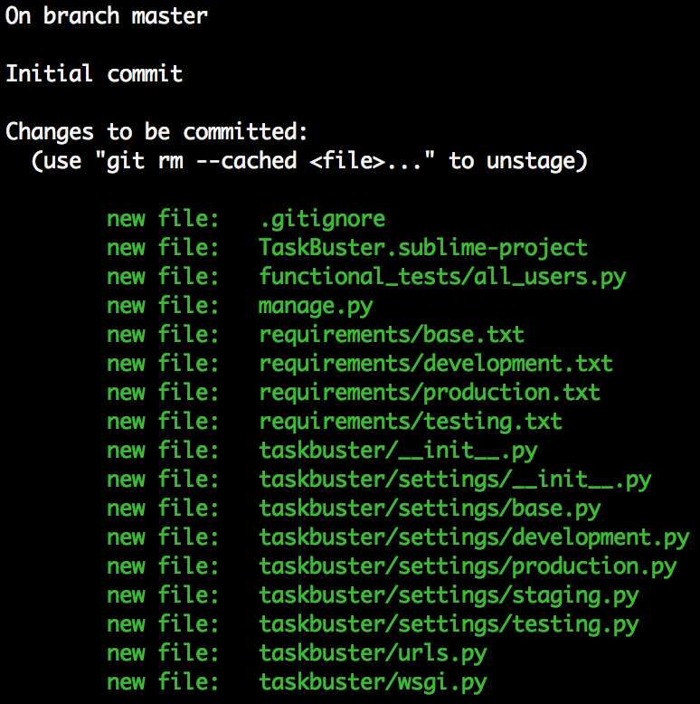

Часть II – Файлы настроек и Управление Версиями
===============================================

.. role:: red
.. role:: redbold
.. role:: bolditalic
.. role:: orange
.. |смайл| image:: _static/1f609.png
.. |smile| image:: _static/1f642.png

.. |br| raw:: html

    

В :doc:`части I </part_1>` этого учебника мы построили рабочую среду и
создали проект :redbold:`TaskBuster`.

Теперь мы настроим различные среды для тестирования,
разработки и производства, редактируя различные файлы настроек Django.

Кроме того, мы удалим :orange:`SECRET_KEY` (секретный ключ Django) из этих файлов,
чтобы **держать его в секрете**.

Далее мы создадим новый репозиторий,
чтобы сохранить наш код в системе управления версиями
и загрузим его в Bitbucket.

Готовы к следующей части? Вот инструкция:

* :ref:`virtual-Environments`
* :ref:`Different-settings.py`
* :ref:`Production-settings.py-Debug-False`
* :ref:`Django-security-and-the-Secret-Key`
* :ref:`Initialize-a-Git-repository-and-Commit`
* :ref:`Upload-your-project-into-Bitbucket`

.. _virtual-Environments:

Виртуальные Среды и файлы требования (requirements files)
---------------------------------------------------------

Один важный момент при работе над проектом - контролировать версии ваших пакетов.
Например, представьте, что вы разрабатываете на одном компьютере с установленным
Django 1.8, и развертываете на сервере, который имеет старую
версию Django, скажем, 1.6. Ваш код хорошо работает локально,
но при его развертывании, могут возникнуть некоторые несовместимые ошибки.
И то же самое может произойти, если более чем один разработчик работает
в одном и том же проекте, у каждого из которых установлены свои собственные версии пакетов.

       Используйте Виртуальные среды для установки пользовательских пакетов,
       и сделайте Django похожим на Кобру!

Стандартным решением этой проблемы является объединение всех пакетов и
сохранение используемых версий в файле с именем :red:`requirements.txt`.
Этот файл будет содержать нечто вроде:

.. code-block:: bash

    Django==1.8.14
    selenium==2.48.0

которые являются пакетами, которые мы установили до этого
(не волнуйтесь, если версии вашей среды различны).

Вы можете увидеть пакеты, установленные в виртуальной среде, набрав

.. code-block:: console

    $ pip freeze

Вы можете увидеть другой пакет, :red:`wheel` (колесо), который устанавливается
по умолчанию в некоторых версиях (не волнуйтесь, если у вас его нет).
Таким образом, вы можете автоматически создать файл :red:`requirements.txt`,
сохранив вывод предыдущей команды в файл:

.. code-block:: console

    $ pip freeze > requirements.txt

Однако, как вы можете заметить, :red:`Selenium` необходим только для среды тестирования,
поэтому нет никакой необходимости, чтобы в среде разработки или в
рабочей среде (production environments) этот пакет был установлен.

Давайте разберемся в этом вопросе, создав папку требований и
отдельный файл для каждой среды. Перейдите в папку
:red:`taskbuster_project` и наберите:

.. code-block:: console

    $ mkdir requirements
    $ touch requirements/{base.txt,development.txt,production.txt,testing.txt}

Примечание: не добавляйте лишних пробелов в предыдущей команде
или она не будет работать |смайл|
И вы можете удалить предыдущий файл :red:`requirements.txt`, так как мы
не будем нуждаться в нем.
Кроме того, вы можете также определить файл :red:`staging.txt`,
если вы планируете запустить получастную версию своего сайта на рабочем сервере.

Давайте в начале отредактируем файл :red:`base.txt`. Этот файл будет содержать
все пакеты, которые являются общими для всех сред. Теперь, он должен
содержать только версию Django:

.. code-block:: console

    $ cd requirements
    $ echo "Django==1.8.14" >> base.txt

Если у вас другая версия, запишите вашу версию вместо этого!

Теперь давайте сделаем три других файла, наследующие
пакеты файла :red:`base.txt`.

.. code-block:: console

    $ echo "-r base.txt" | tee -a development.txt testing.txt production.txt

Наконец, мы должны добавить Selenium в файл тестирования:

.. code-block:: console

    $ echo "selenium==2.48.0" >> testing.txt

опять же, напишите здесь свою версию.

Ок, теперь у нас все готово. Когда новый программист присоединится к нашей
команде, мы скажем ему создать две различные среды, один для тестирования, а другой
для разработки (рабочая среда-production environment для развертывания).

Затем, ему нужно будет только активировать каждую из этих сред и установить пакеты,
сохраненные в каждом файле требований:

.. code-block:: console

    $ workon tb_dev
    $ pip install -r requirements/development.txt

    $ workon tb_test
    $ pip install -r requirements/testing.txt

.. _Different-settings.py:

Разные settings.py для каждой среды
-----------------------------------

Каждая среда, определенная ранее, имеет разную цель, и поэтому,
для каждой из них будут нужны различные конфигурации. Например, конфигурация
базы данных для рабочей среды и разработки могут отличаться, или среда
тестирования может использовать некоторые приложения Django,
которые не нужны в других средах (например, :red:`selenium`).

Вот почему мы определим различные файлы настроек для каждой среды.
Сначала, мы создадим папку, чтобы содержать наши файлы настроек
внутри папки :red:`taskbuster`:

.. code-block:: console

    $ mkdir taskbuster/settings

Эта папка будет содержать:

*  файл :red:`__init__.py`, чтобы сделать эту папку пакетом Python
* :red:`base.py` будет содержать все параметры, которые являются общими во всех средах. Другие файлы настроек наследуют от него.
* :red:`development.py` для локальной разработки.
* :red:`testing.py` для тестирования.
* :red:`production.py` будет использоваться в рабочей среде.
* :red:`staging.py` если вы хотите запустить промежуточную версию на рабочем сервере вашего проекта.

Давайте создадим все эти файлы внутри папки :red:`taskbuster/settings`:

.. code-block:: console

    $ cd taskbuster/settings
    $ touch __init__.py development.py testing.py production.py staging.py

И отредактируйте каждый из них (:red:`development.py`, :red:`testing.py`,
:red:`production.py` и :red:`staging.py`), чтобы они наследовали из файла
:red:`base.py` — мы создадим этот файл через секунду :-):

.. code-block:: python

    # -*- coding: utf-8 -*-
    from .base import *

И наконец, мы должны переместить и переименовать файл :red:`settings.py`,
созданный Django, чтобы наш файл :red:`base.py` был внутри папки настроек.
Работая в папке настроек, вы должны ввести:

.. code-block:: console

    $ mv ../settings.py base.py

После создания этих файлов, нам нужно указать виртуальную
среду для работы с правильным файлом настроек.

С :red:`virtualenvwrapper` есть способ настроить различные крючки,
которые выполняются прежде или после активации виртуальной среды,
и прежде или после его деактивации. Это означает, что мы можем определить ряд
операторов, которые будут выполнены на различных этапах
жизненного цикла виртуальной среды. Эти крючки сохранены в папке :red:`bin`,
внутри папки виртуальной среды, и их имена :red:`preactivate`, :red:`postactivate`,
:red:`predeactivate` and :red:`postdeactivate`.

В нашем случае, мы зададим скрипт :red:`postactivate`, который установит
переменную ``DJANGO_SETTINGS_MODULE`` сразу после активации виртуальной среды,
и :red:`predeactivate`, который очистит ее перед деактивацией.

.. code-block:: console

    $ workon tb_dev
    $ cd $VIRTUAL_ENV/bin

Последняя команда приведет вас к папке виртуальной среды, где находятся
различные крючки. Отредактируйте файл :red:`postactivate`, добавив:

.. code-block:: bash

    export DJANGO_SETTINGS_MODULE="taskbuster.settings.development"

и измените файл :red:`predeactivate`, добавив:

.. code-block:: bash

    unset DJANGO_SETTINGS_MODULE

Сделайте то же самое со средой тестирования, с единственным изменением:

.. code-block:: bash

    export DJANGO_SETTINGS_MODULE="taskbuster.settings.testing"

Пришло время проверить! Вернитесь в папку :red:`taskbuster_project`
и активируйте вашу среду разработки. Затем выполните команду:

.. code-block:: console

    $ python manage.py runserver

и в показанном выводе вы должны увидеть строку с указанием,
что вы используете файл :red:`taskbuster.development_settings`, что-то вроде:

.. code-block:: console

    Django version 1.8, using settings 'taskbuster.settings.development'

Откройте другую вкладку (оставьте предыдущий сервер активным),
и активируйте среду тестирования. Убедитесь, что она использует файл
:red:`taskbuster.testing_settings`. Вероятно, она будет жаловаться,
говоря, что этот порт уже используется в среде разработки,
поэтому укажем другой порт:

.. code-block:: console

    $ python manage.py runserver 127.0.0.1:8001

Далее, выйдите из сервера в среде тестирования и запустите функциональный тест:

.. code-block:: console

    $ python functional_tests/all_users.py

Да! Мы ничего не сломали |smile|

.. _Production-settings.py-Debug-False:

Рабочий (production) Settings.py  – отладка ложь (Debug False)
------------------------------------------------------------------

Одна **важная** вещь для запоминания - установить значение переменной
``DEBUG`` равной ``False`` в вашем рабочем файле настроек (production).

Примечание: В предыдущих версиях до Django 1.8 вам также необходимо установить
``TEMPLATE_DEBUG`` на false. Однако, с введением новой настройки шаблона
(``TEMPLATE`` setting), старый ``TEMPLATE_DEBUG`` автоматически устанавливается
на ``DEBUG``. Если вы действительно хотите задать это значение, проверьте
`официальную документацию. <https://docs.djangoproject.com/en/1.8/ref/settings/#template-debug>`_
или `русскую версию документации <http://djbook.ru/rel1.8/ref/settings.html#template-debug>`_.

Во-первых, вырежьте переменную DEBUG из файла настроек :red:`base.py`
и скопируйте ее в файлы настроек :red:`development.py` и :red:`testing.py`.

.. code-block:: python

    DEBUG = True

Затем добавьте его в файл настроек :red:`production.py` и сделайте
его значение ложным - :orange:`False`:

.. code-block:: python

    DEBUG = False

Таким образом, каждая среда будет иметь правильное значение этой переменной.
Если вы также определили файл :red:`staging.py`, также скопируйте ее туда.

.. _Django-security-and-the-Secret-Key:

Безопасность Django и Секретный ключ
------------------------------------

Если вы откроете файл :red:`taskbuster/settings/base.py`,
вы увидите переменную с именем ``SECRET_KEY``. Эта переменная
**должна храниться в тайне**, и поэтому быть **вне контроля версий**.

Одним из вариантов было бы добавить файл :red:`base.py` в файл :red:`.gitignore`,
то есть удалить его из системы управления версиями. Тем не менее, в ходе
разработки проекта этот файл претерпевает много изменений,
и поэтому очень полезно иметь его в системе управления версиями,
особенно если вы хотите поделиться им с коллегами.
Поэтому, лучшим подходом является удаление переменной secret key и
импортирование ее откуда-то еще. И это ``где-то еще`` должно оставаться вне контроля версий.

Подход, который мы будем использовать здесь - поместить секретный ключ
внутри нашей конфигурации виртуальной среды, и получить ключ от окружающей среды,
импортировав его в файле :red:`base.py`.

Примечание: Если вы используете Apache этот метод не будет работать. Наилучший вариант
заключается в том, что вы сохраняете свой ``SECRET_KEY`` (секретный ключ) в
какой-нибудь файл и импортируете его в файле :red:`base.py`. Ключевой файл должен
быть удален из системы управления версиями, добавлением его в файл :red:`.gitignore`.
Я рекомендую вам прочитать книгу
`Two Scoops of Django 1.6 <http://www.amazon.com/Two-Scoops-Django-Best-Practices/dp/098146730X>`_,
раздел 5.4. (Вы можете посмотреть новую версию этой книги, обновленную для Django 1.8!)

Чтобы включить секретный ключ в виртуальной среде, мы будем также работать
с крючками :red:`postactivate` и :red:`predeactivate` в virtualenvwrapper.

Активируйте среду tb_dev и перейдите к папке :red:`bin` с помощью ярлыка

.. code-block:: console

    $ cd $VIRTUAL_ENV/bin

Если вы введете команду :orange:`ls`, то увидите, что она содержит файлы,
которые мы только что описали. Измените файл :red:`postactivate` и добавьте строку
секретного ключа.

.. code-block:: bash

    export SECRET_KEY="ваш_секретный_ключ_django"

Примечание: не ставьте пробелы вокруг знака = (равно).

Далее отредактируйте фал :red:`predeactivate` и добавьте строку:

.. code-block:: bash

    unset SECRET_KEY

Таким образом, если вы введете:

.. code-block:: console

    $ workon tb_dev
    $ echo $SECRET_KEY
    your_secret_django_key
    $ deactivate
    $ echo $SECRET_KEY

Где последняя строка указывает на то, что вывод отсутствует. Это означает,
что переменная ``SECRET_KEY`` видна только при работе в этой
виртуальной среде, как мы и хотели.

Повторите тот же процесс для виртуальной среды :red:`tb_test`.

Далее, деактивируйте и активируйте каждую среду, чтобы эти изменения вступили в силу.

И наконец, отредактируйте файл :red:`base.py`, удалите ``SECRET_KEY`` и добавьте
следующие строки:

.. code-block:: python

    from django.core.exceptions import ImproperlyConfigured

    def get_env_variable(var_name):
        try:
            return os.environ[var_name]
        except KeyError:
            error_msg = "Set the %s environment variable" % var_name
            raise ImproperlyConfigured(error_msg)

    SECRET_KEY = get_env_variable('SECRET_KEY')

Функция ``get_env_variable`` пытается получить переменную ``var_name``
из окружающей среды, и если не находит ее, выдает ошибку ``ImproperlyConfigured``.
Таким образом, когда вы попытаетесь запустить приложение и переменная ``SECRET_KEY``
не найдена, то вы сможете увидеть сообщение о том, почему ваш проект потерпел неудачу.

Давайте проверим, что все работает как и ожидалось. Сохраните :red:`base.py`,
деактивируйте обе среды и активируйте их снова, в разных вкладках терминала.

Запустите сервер разработки в среде :red:`tb_dev`

.. code-block:: console

    $ python manage.py runserver

и запустите функциональный тест в среде :red:`tb_test`

.. code-block:: console

    $ python functional_tests/all_users.py

Надеюсь, что тест также работает у и вас!! |smile|

Примечание: при развертывании вашего приложения, вам необходимо будет указать
``SECRET_KEY`` на своем сервере. Например, если вы используете :red:`Heroku`,
вы можете использовать:

.. code-block:: console

    $ heroku config:set SECRET_KEY="ваш_секретный_ключ"

Но не волнуйтесь, мы рассмотрим Heroku позднее в этом учебнике!! |smile|

.. _Initialize-a-Git-repository-and-Commit:

Инициализация Git репозитория и фиксация (commit)
-------------------------------------------------

Хорошо! теперь мы готовы передать наш проект в новое хранилище!
Примечание: вы можете прочитать
`базовый урок по системе git здесь. <http://www.marinamele.com/2014/07/git-tutorial-create-a-repository-commit-git-branches-and-bitbucket.html>`_.

Перейдите в каталог :red:`taskbuster_project` и введите:

.. code-block:: console

    $ git init .

для инициализации хранилища данных в текущей папке.
Вы увидите новую папку с именем :red:`.git`, содержащую новое хранилище (далее репозиторий).

Перед тем как добавлять файлы в репозиторий, мы должны подумать,
есть ли там файлы, которые мы хотим держать подальше от от системы управления версиями.

Обратите внимание, что после запуска сервера разработки, мы имеем дополнительные файлы:

* :red:`db.sqlite3` – база данных
* :red:`__pycache__` –  папка, содержащая все `*.pyc` файлы.

Эти два файла должны быть удалены из системы управления версиями.
Создайте файл :red:`.gitignore` внутри папки :red:`taskbuster_project` и напишите:

.. code-block:: text

    db.sqlite3
    __pycache__
    TaskBuster.sublime-workspace

где мы также включили рабочее пространство sublime text (как мы видели в части I,
sublime генерирует два разных файла при создании проекта.
Мы хотим, чтобы только заканчивающийся на -project был на системе управления версиями,
но не тот, который заканчивается на -workspace). |br|
Затем, давайте добавим все файлы текущего каталога в промежуточную область
(за исключением тех, которые в файле :red:`.gitignore`)

.. code-block:: console

    $ git add .

И проверим файлы, добавленные в промежуточную область набрав:

.. code-block:: console

    $ git status

Вы должны увидеть что-то вроде этого, со всеми новыми добавленным файлами в зеленом цвете:

Если вы видите какой-то файл, который вы не хотите передавать, вы можете удалить его с помощью:

.. code-block:: console

    $ git rm --cached path_of_file

не забудьте добавить его в файл :red:`.gitignore` для последующих фиксаций (коммитов).

Наконец, давайте передадим наши изменения:

.. code-block:: console

    $ git commit -m "Taskbuster project created"

Флаг :orange:`-m` указывает на то, что следующий текст будет использоваться
для описания этого коммита. Если вы просто введете :orange:`git commit`,
будет открыт редактор для записи его описания (по умолчанию, это редактор VI).

Вы можете посмотреть коммит так

.. code-block:: console

    $ git log

.. _Upload-your-project-into-Bitbucket:

Загружаем ваш проект в систему Bitbucket
----------------------------------------

Создайте аккаунт в системе Bitbucket если у вас нет, и создайте
**новый пустой репозиторий**. Мы используем Bitbucket, потому что он
позволяет использовать частные хранилища, но шаги, описанные здесь,
будут работать почти так же как и для GitHub.

Вы должны будет определить URL-адрес этого репозитория,
который будет чем-то вроде

:red:`https://имя_пользователя@bitbucket.org/имя_пользователя/имя_репозитория.git`

Вы можете найти его в: :red:`Overview` (Обзор)  –> :red:`Command line` (Командная Строка) –>
:red:`I have an existing project` (У меня есть существующий проект).

В первую очередь, нам надо добавить Bitbucket как удаленный репозиторий.
Перейдите в папку :red:`taskbuster_project` и введите:

.. code-block:: console

    $ git remote add origin https://user_name@bitbucket.org/user_name/repository_name.git

где вы должны изменить URL-адрес на адрес вашего репозитория.
Примечание: Предыдущая команда является одной строкой.
Это создаст псевдоним origin, ссылающийся к вашему Bitbucket репозиторию
(использование origin в качестве псевдонима для удаленного репозитория
является общим соглашением).

Далее, давайте перенесем наше существующее хранилище
в новый Bitbucket репозиторий с помощью:

.. code-block:: console

    $ git push -u origin --all

где флаг :orange:`–all` делает так, чтобы все ссылки (refs) в refs/heads
были переданы, а флаг :orange:`-u` обозначает :orange:`–set-upstream -набор-вверх`
(добавляет ссылку отслеживания). Вы должны будете ввести свой пароль.

В конце концов, вы увидите сообщение:

.. code-block:: console

    Branch master set up to track remote branch master from origin.

Вы можете посмотреть ваши активные ветви с помошью

.. code-block:: console

    $ git branch -a
    * master
    remotes/origin/master

Хорошо! Теперь, когда у нас есть наш первый проект с хорошей
рабочей средой, и в системе управления версиями, мы можем работать
над нашей домашней страницей!

Но… я еще не говорила о создании моделей, простой настройке статических
файлов и шаблонов, чтобы иметь хорошую домашнюю страницу с помощью CSS
— я ненавижу разработку без базового CSS, так что это одна из первых вещей,
которые я обычно включаю.

Узнайте это и многое другое в следующей части урока!
:doc:`Создание домашней страницы используя РЧТ, Статические файлы и настройки Шаблонов </part_3>`

Пожалуйста, поделитесь этим учебником с друзьями разработчиками! |смайл|
