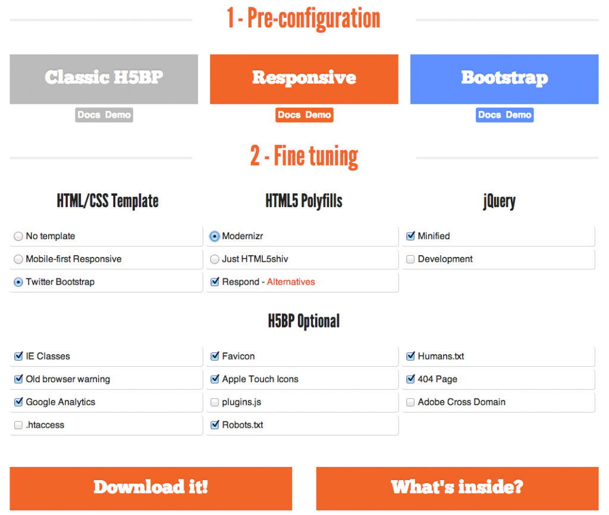

Часть III – Создание домашней страницы используя РЧТ, Статические файлы и настройки Шаблонов
============================================================================================

.. role:: red
.. role:: redbold
.. role:: bolditalic
.. role:: orange
.. |;)| image:: _static/1f609.png
.. |:)| image:: _static/1f642.png

.. |br| raw:: html

    

После того, как мы установили нашу рабочую среду, мы можем
сосредоточиться на **создании домашней страницы** нашего сайта.

Однако, это не будет обычной пустой домашней страницей
с одной только надписью “привет мир” в ней.

Мы настроим как статические файлы, так и шаблоны,
внедрим шаблон HTML5 и фреймворк Twitter Bootstrap,
и создадим **намного лучшую** версию обычной домашней страницы
(да, она также будет иметь надпись "привет мир"...)

К тому же, мы будем подчиняться Козе Тестирования и следовать **Разработке Через Тестирование**
(РЧТ), чтобы создать домашнюю страницу. Здесь вы узнаете много интересного! |;)|

Вот то, что мы рассмотрим:

* :ref:`Static-Files-Settings`
* :ref:`Templates-Settings`
* :ref:`Initializr-HTML5-Boilerplate-and-Twitter-Bootstrap`
* :ref:`Home-Page-with-TDD-Tests-first`
* :ref:`Home-Page-with-TDD-Code-next`
* :ref:`Commit-again-to-your-local-repository-and-Bitbucket`

.. _Static-Files-Settings:

Настройки Статических Файлов
----------------------------

Откройте общий файл настроек (:red:`settings/base.py`) и найдите переменную
``INSTALLED_APPS``. Убедитесь, что она содержит приложение :redbold:`'django.contrib.staticfiles'`.

Далее перейдите в конец файла и найдите строку:

.. code-block:: python

    STATIC_URL = '/static/'

Эта строка указывает Django искать :orange:`статические` (static) файлы в папке
static внутри каждого из наших приложений.

Однако, некоторые статические файлы используются для всего проекта
и не должны быть внутри конкретного приложения. Перейдите в папку :red:`taskbuster`,
на том же уровне где находятся файлы настроек, и создайте папку с именем :orange:`static`.

.. code-block:: bash

    $ cd taskbuster
    $ mkdir static

Этот каталог будет содержать все статические файлы, которые являются
глобальными для проекта, такие как CSS или файлы JavaScript.

Если вы посмотрите на начало файла :red:`settings/base.py`, вы найдете строку

.. code-block:: python

    BASE_DIR = os.path.dirname(os.path.dirname(os.path.abspath(__file__)))

которая указывает на папку, содержащую другую папку, которая содержит
фактический файл, т.е. папку :red:`taskbuster`.

.. note::
    если вы работаете с одним  файлом :red:`settings.py`, расположенным в папке
    :red:`taskbuster` (без дополнительной папки настроек :red:`settings`,
    которую мы создали здесь) вам придется переопределить :orange:`BASE_DIR`
    для того, чтобы указать папку :red:`taskbuster`. Это потому, что без
    дополнительной папки настроек в середине, предыдущий :orange:`BASE_DIR`
    будет указывать на верхнюю папку :red:`taskbuster_project`, вместо папки
    :red:`taskbuster`. Вы должны переопределить его так

.. code-block:: python

    BASE_DIR = os.path.dirname(os.path.abspath(__file__))

Чтобы указать Django искать статические файлы в папке :red:`taskbuster/static`,
которую мы только что создали, напишите следующее после объявления :orange:`STATIC_URL`:

.. code-block:: python

    STATICFILES_DIRS = (
    os.path.join(BASE_DIR, "static"),
    )

Не забудьте запятую в конце! При такой конфигурации Django будет искать
статические файлы в папке :red:`static` внутри каждого приложения и
в папке :red:`taskbuster/static`, которую мы только что создали.

.. _Templates-Settings:

Настройки Шаблонов
------------------

Подобная вещь происходит и с шаблонами.
По умолчанию, загрузчик шаблонов Django
ищет шаблоны в папке :red:`templates` внутри каждого приложения.

Но давайте создадим папку шаблонов :red:`templates` внутри :red:`taskbuster`,
чтобы содержать все шаблоны, которые будут использоваться всюду по всему
проекту, такие как :red:`base.html` или некоторые страницы ошибок.

.. code-block:: bash

    $ cd taskbuster
    $ mkdir templates

Затем обновите файлы настроек и отредактируйте ключ :red:`DIRS`
в переменной :red:`TEMPLATE` так:

.. code-block:: python

    # Templates files
    TEMPLATES = [
    {
        'BACKEND': 'django.template.backends.django.DjangoTemplates',
        'DIRS': [os.path.join(BASE_DIR, "templates")],
        'APP_DIRS': True,
        'OPTIONS': {
            'context_processors': [
                 'django.template.context_processors.debug',
                'django.template.context_processors.request',
                'django.contrib.auth.context_processors.auth',
                'django.contrib.messages.context_processors.messages',
            ],
        },
    },
    ]

Как и со статическими файлами, Django будет искать шаблоны,
расположенные в папке, названной :red:`templates` в каждом приложении и в
папке :red:`taskbuster/templates`, которую мы только что создали.

.. _Initializr-HTML5-Boilerplate-and-Twitter-Bootstrap:

Initializr: шаблон HTML5 и Twitter Bootstrap
--------------------------------------------

В целях проверки, что конфигурация шаблонов и статических файлов работает,
и также, потому что мне нравится разрабатывать в Django, по крайней мере,
с некоторым CSS, мы собираемся включить
`Шаблон HTML5 <http://html5boilerplate.com/>`_
и `Bootstrap <http://getbootstrap.com/>`_.
Эти инструменты помогают создавать адаптивные шаблоны,
которые работают во многих браузерах.

Здесь мы будем использовать `Initializr <http://www.initializr.com/>`_,
смешанную версию, которая сочетает в себе Шаблон HTML5 и Bootstrap.
Перейдите на этот сайт, нажмите на "Получить Пользовательскую Сборку"
(Get Custom Build), и выберите приоритеты вашего проекта.
Конфигурация, которую я выбрала для этого проекта, показана на изображении
(за исключением Apple Touch Icons,
которые не используются в этом проекте):

После того как вы загрузите пакет, распакуйте и преобразуйте его содержимое:

* Переместите файлы :red:`index.html`, :red:`404.html`, :red:`humans.txt` и :red:`robots.txt` в папку :red:`taskbuster/templates`.
* Измените имя :red:`index.html` на :red:`base.html`. Индексный файл, как правило является шаблоном вашей Домашней страницы, но мы будем использовать его в качестве базового шаблона - все наши шаблоны сайта будут наследовать от этого базового шаблона.
* Переместите другие файлы и папки в папку :red:`taskbuster/static`
* Если у вас есть значок, который вы хотите использовать для вашего приложения, замените его на файл :red:`favicon.ico` (я рекомендую вам использовать то же имя).
* Я также удалила файлы :red:`apple-touch-icon.png`, :red:`browserconfig.xml`, :red:`tile-wide.png` и :red:`tile.png`.

.. _Home-Page-with-TDD-Tests-first:

Домашняя страница с РЧТ – Сначала тесты
---------------------------------------

Для того чтобы увидеть, загружаются ли статические файлы и шаблоны
правильно, нам будет нужен тест. Ну вы знаете… Повинуйтесь Козе тестирования!
:bolditalic:`Сначала тест, сначала тест!`

.. figure:: _static/obey_the_testing_goat-300x290.jpg
       :alt: testing goat
       :align: center

       Сначала тест, Сначала тест!

На самом деле, чтобы работать с Разработкой Через Тестирование (РЧТ)
- Test Driven Development, мы должны были написать тест даже прежде,
чем установить шаблоны и статические папки. Но я сперва хотела закончить
редактирование файлов настроек.

Вначале, мы преобразуем папку :red:`functional_tests` в пакет,
включив пустой файл с именем :red:`__init__.py` внутри.

.. code-block:: bash

    touch functional_tests/__init__.py

Таким образом, мы можем запустить наши функциональные тесты вот так:

.. code-block:: bash

    $ python manage.py test functional_tests

Однако, исполнитель тестов (test runner) находит только файлы, которые
начинаются со слова "тест", так что давайте переименуем
:red:`all_users.py` на :red:`test_all_users.py`.

Мы дадим git проконтролировать это, так что репозиторий обнаружит перемещение правильно:

.. code-block:: bash

    $ git mv functional_tests/all_users.py functional_tests/test_all_users.py

Запустите сервер разработки, используя среду :red:`tb_dev`, а затем выполните
функциональные тесты в среде :red:`tb_test`.
Все должно работать как и прежде, ничего не сломалось!

Но я уверена, что вам не нравится эта игра с двумя средами, не так ли?
Необходимость запускать сервер, используя :red:`tb_dev` и тестировать с :red:`tb_test`.
**Почему сам тест не может создавать сервер?**

**Кроме того, изменения, сделанные этими функциональными тестами являются постоянными.**
Представьте себе, что во время одного теста,
мы создаем экземпляр модели (например, нового пользователя).
Мы хотим, чтобы после выполнения теста, этот экземпляр (пользователь)
исчез из нашей базы данных, верно?
Но с функциональными тестами, мы просто запускаем сервер разработки
и играем с базой данных разработки, так что эти изменения сохраняются
даже после завершения теста.

Но не волнуйтесь, есть :orange:`LiveServerTestCase`, чтобы сделать
нашу жизнь намного проще! |;)|

Как мы увидим, экземпляры этого класса создают сервер с **базой данных тестирования**,
так же как и когда мы запускали **unittests**.

Теперь, давайте отредактируем файл :red:`functional_tests/test_all_users.py`
и проверим, что обе шаблоны и статические папки работают, как и ожидалось.
Например, мы можем протестировать эти две разные вещи.

* Заголовок в домашней странице - “TaskBuster”
* Цвет текста заголовка h1 в домашней странице :red:`rgba(200, 50, 255, 1)` ~ розовый цвет.

Итак, давайте создадим этот тест! |br|
Примечание: файл :red:`test_all_users.py` содержит ``NewVisitorTest``,
созданный в части I. Вы должны заменить тот тест на этот:

.. code-block:: python
    :linenos:

    # -*- coding: utf-8 -*-
    from selenium import webdriver
    from django.core.urlresolvers import reverse
    from django.contrib.staticfiles.testing import LiveServerTestCase

    class HomeNewVisitorTest(LiveServerTestCase):

        def setUp(self):
            self.browser = webdriver.Firefox()
            self.browser.implicitly_wait(3)

        def tearDown(self):
            self.browser.quit()

        def get_full_url(self, namespace):
            return self.live_server_url + reverse(namespace)

        def test_home_title(self):
            self.browser.get(self.get_full_url("home"))
            self.assertIn("TaskBuster", self.browser.title)

        def test_h1_css(self):
            self.browser.get(self.get_full_url("home"))
            h1 = self.browser.find_element_by_tag_name("h1")
            self.assertEqual(h1.value_of_css_property("color"),
                             "rgba(200, 50, 255, 1)")

Давай пройдемся через этот код шаг за шагом:

* Сначала, мы определяем вспомогательную функцию с именем ``get_full_url``, которая принимает один аргумент, :orange:`пространство имен`
    * :orange:`Пространство имен` является идентификатором для url. Это хорошая вещь в Django: когда вы работаете с идентификаторами, вы можете изменить url-адрес, на то, что вы хотите, а *код просто работает* как и прежде.
    * ``self.live_server_url`` дает вам локальный url-адрес узла. Мы используем этот метод потому, что тестовый сервер использует другой url (обычно ``http://127.0.0.1:8021``), и этот метод является более гибким.
    * reverse дает **относительный** url-адрес из заданного пространства имен, здесь ``/``
    * Полученная функция дает вам абсолютный адрес этого пространства имен (сумма двух предыдущих), ``http://127.0.0.1:8021/``.
* Метод ``test_home_title`` проверяет, что заголовок домашней страницы содержит слово :red:`TaskBuster`. Мы создадим шаблон для этого, так что если заголовок существует, то это означает, что шаблон был загружен правильно.
* Метод ``test_h1_css`` проверяет, что текст h1 имеет нужный цвет. Правило CSS для цвета текста будет в файле CSS, который означает, что если тест пройден, то статические файлы загружаются правильно.
* Наконец, обратите внимание на то, что мы удалили, выражение ``if __name__ == '__main__'``, так как :red:`functional_tests` является теперь пакетом, который будет работать с исполнителем тестов Django.

Как только мы создали наш тест, РЧТ говорит нам следовать за циклом:

* запускаем тест и смотрим, что он терпит неудачу
* пишем некоторый код так, чтобы он исправлял тестовое сообщение об ошибке (написать только код, который исправляет сообщение об ошибке, показанное на тестовом провале, не ожидайте других возможных ошибок)

Мы должны следовать этому циклу до полного прохождения теста.
Это будет более ясно в следующем разделе.

.. _Home-Page-with-TDD-Code-next:

Домашняя страница с РЧТ – Затем код
-----------------------------------

Теперь, когда у нас есть функциональный тест для нашей домашней страницы,
мы можем запустить его и посмотреть, как он терпит неудачу.
В наше тестовой среде :red:`tb_test`:

.. code-block:: bash

    $ python manage.py test functional_tests

Мы видим, что первая ошибка заключается в том, что пространство имен
:redbold:`"home"` не определено. Откройте файл :red:`taskbuster/urls.py`
и импортируйте представление ``home`` из :red:`views.py` (в зависимости от
вашей версии Django, вам, возможно, потребуется создать этот файл сначала:
:red:`taskbuster/views.py`):

.. code-block:: python

    from .views import home

Обратите внимание на то, что мы используем относительный импорт, чтобы импортировать
домашнее представление ``home``. Таким образом, мы можем поменять
имя нашего проекта или приложения, не ломая url-адреса.

Затем, добавьте следующий URL-адрес:

.. code-block:: python

    urlpatterns = [
    ...
    url(r'^$', home, name='home'),
    ...
    ]

Если вы снова запустите тест, он потерпит неудачу, поскольку у нас нет определенного
представления home. Давайте определим глупого, создайте файл :red:`taskbuster/views.py`
и определите представление:

.. code-block:: python

    def home(request):
         return ""

что дает провал теста, потому что домашняя страница не имеет в его названии
слова TaskBuster.

Давайте сосредоточимся теперь на наших шаблонах: откройте файл
:red:`taskbuster/templates/base.html` с браузера, чтобы иметь
представление о том, что в нем. Совсем ужасно, да? Это потому, что статические
файлы не загружаются.

Этот :red:`base.html` будет нашим базовым шаблоном, а все остальные
шаблоны проекта будет наследовать от него, включая Домашнюю страницу.

Итак, пришло время для unittest. Да, я знаю, вы просто хотите написать код
шаблона главной страницы, но… :redbold:`Повинуемся Козе Тестирования!` |;)|

UnitTests предназначены для проверки небольших фрагментов кода,
с точки зрения разработчика. Например, понятно, что пользователя не волнует,
наследуется ли шаблон домашней страницы от другого шаблона, пока он выводит
на экран его содержимое. Но разработчик заботится, и именно поэтому
мы должны написать UnitTest. Кроме того, я поняла, что, когда я должна
думать о тесте, я пишу более чистый код. Я думаю, это потому, что
необходимость определения тестов заставляет думать вас о том, **чего вы именно**
хотите от вашего кода. И это очищает ваш ум |;)|

Создайте файл :red:`test.py` внутри папки :red:`taskbuster`
и напишите следующий тест:

.. code-block:: python
    :linenos:

    # -*- coding: utf-8 -*-
    from django.test import TestCase
    from django.core.urlresolvers import reverse

    class TestHomePage(TestCase):

        def test_uses_index_template(self):
            response = self.client.get(reverse("home"))
            self.assertTemplateUsed(response, "taskbuster/index.html")

        def test_uses_base_template(self):
            response = self.client.get(reverse("home"))
            self.assertTemplateUsed(response, "base.html")

Вы можете запустить эти тесты, используя

.. code-block:: bash

    $ python manage.py test taskbuster.test

Очевидно, что они потерпят неудачу… Сначала, давайте создадим шаблон
:red:`taskbuster/index.html`:

.. code-block:: bash

    $ cd taskbuster/templates
    $ mkdir taskbuster
    $ touch taskbuster/index.html

и отредактируйте :red:`taskbuster/views.py` так, чтобы он имел:

.. code-block:: python

    # -*- coding: utf-8 -*-
    from django.shortcuts import render

    def home(request):
        return render(request, "taskbuster/index.html", {})

где мы использовали функцию render которая позволяет загрузить шаблон,
создать контекст, добавив кучу переменных по умолчанию, такие как
информация о текущем вошедшем в систему пользователе или о текущем языке,
выполняет его и возвращает объект :red:`HttpResponse`, все в одной функции.
Примечание: информация, добавленная по умолчанию, зависит от контекста
процессоров шаблона (template context processors),
которые вы включили в свой файл настроек.

Если вы снова запустите юниттесты (unittests), вы увидите, что первый из них проходит,
указывая на то, что домашняя страница использует шаблон :red:`taskbuster/index.html`.
Нам необходимо сделать так, чтобы этот шаблон наследовал от шаблона :red:`base.html`.

Поэтому давайте отредактируем шаблон :red:`base.html`. Сейчас нас интересует
только **тег заголовка** (title) внутри главного тега head. Ищите его в файле
и запишите следующее внутри:

.. code-block:: html

    <head>
    ...
    <title></title>
    ...
    </head>

Эти два шаблонных тега, ```` и ````
обозначают начало и конец блока контента, содержание которого может
быть заменено дочерними шаблонами. Вы увидите это ясно через минуту.

Отредактируйте снова файл :red:`index.html`, заставив его наследоваться от
файла :red:`base.html` и добавьте это в заголовок.

.. code-block:: html

    
    TaskBuster Django Tutorial

Идея в том, что :red:`index.html` наследуется от :red:`base.html` (он использует все его содержимое),
за исключением блоков, отмеченных с этими специальными шаблонными тегами.
В этом случае, он заменяется содержимым в шаблонном теге :red:`index.html` в
соответствующий блок в :red:`base.html`.

Давайте снова запустим модульные тесты unittests:

.. code-block:: bash

    $ python manage.py test taskbuster.test

Ок...!! Замечательно, они прошли!

А как насчет функциональных тестов?

.. code-block:: bash

    $ python manage.py test functional_tests

Один прошел, один не удался. Это что-то!
Но **мы по-прежнему должны позаботиться о статических файлах!**

Вначале, давайте определим наш собственный файл CSS, редактируя файл
:red:`taskbuster/static/css/main.css` и добавив:

.. code-block:: css

    .jumbotron h1 {
    color: rgba(200, 50, 255, 1);
    }

Затем, измените снова :red:`base.html` и добавьте это в начало файла
(даже перед утверждением ``<!DOCTIPE html>``):

.. code-block:: html

    

Потом, ищите все ссылки на статические файлы и скрипты JavaScript, такие как

.. code-block:: html

    <link rel="stylesheet" href="css/xxx.css">
    

и замените их на это:

.. code-block:: html

    <link rel="stylesheet" href="">
    

Мы не можем добавить тег ``""``, потому что мы бы повредили строку.
В этом случае, можно включить статический файл указав относительный путь:

.. code-block:: html

    

.. note::
    несмотря на то, что оба метода для импорта статическиз файлов работают,
    лучше использовать шаблонный тег, если вы планируете использовать
    сеть доставки контента - content delivery network (CDN) для обслуживания
    статических файлов.

Хорошо, давайте снова запустим функциональный тест! О нееет!
Я получила уродливую ошибку, чего там не было раньше!

Это вызвано тем, что :orange:`LiveServerTestCase` не поддерживает статические файлы…

Но не волнуйтесь, как обычно, Django имеет решение для этого!
У меня есть другой тестовый класс, который поддерживает статические файлы!

Чтобы внести изменения, отредактируйте :red:`functional_tests/test_all_users.py`,
удалите строки со знаком "минус" и добавьте те, которые с "плюсом":

.. code-block:: python

    - from django.test import LiveServerTestCase
    + from django.contrib.staticfiles.testing import StaticLiveServerTestCase

    - class HomeNewVisitorTest(LiveServerTestCase):
    + class HomeNewVisitorTest(StaticLiveServerTestCase):

Запустите свои тесты снова и да! Они прошли! |:)|

Если вы хотите выполнить модульные тесты unittests
и функциональные тесты вместе, то можете использовать

.. code-block:: bash

    $ python manage.py test

Вы также можете взглянуть на localhost и посмотреть, насколько привлекательна
домашняя страница, когда файлы CSS теперь загружаются правильно |;)|

… вероятно, не самый лучший выбор цвета текста для h1, хотя!

.. note::
    если при выполнении функциональных тестов вы получите сообщение
    об ошибке с Selenium, который говорит, что
    *браузер, кажется, вышел прежде чем мы могли бы подключиться*,
    попробуйте обновить selenium в вашей рабочей среде:

.. code-block:: bash

    $ pip install -U selenium

Это должно решить вашу проблему |;)|

.. _Commit-again-to-your-local-repository-and-Bitbucket:

Снова фиксируем (commit) в локальный репозиторий и Bitbucket
------------------------------------------------------------

Сейчас самое хороше время, чтобы сделать еще один коммит!

.. code-block:: bash

    $ git add .
    $ git status

убедитесь, что вы добавляете только те файлы, которые вы
хотите зафиксировать.
Кроме того, в начале вывода он говорит

.. code-block:: bash

    Your branch is up-to-date with 'origin/master'

которое означает, что фактическое основное ответвление в том же состоянии
как и ответвление источника в Bitbucket. Давайте посмотрим, что произойдет
после того, как мы зафиксируем новые изменения:

.. code-block:: bash

    $ git commit -m "Settings, static files and templates"

И давайте проверим состояние снова…

.. code-block:: bash

    $ git status
    On branch master
    Your branch is ahead of 'origin/master' by 1 commit.
    (use "git push" to publish your local commits)

    nothing to commit, working directory clean

Таким образом, локальное основное ответвление - одна фиксация перед
ведущим ответвлением источника. Давайте исправим это, вытолкнув
последние фиксации в хранилище Bitbucket:

.. code-block:: bash

    $ git push origin master

Так что теперь, наше ответвление снова актуально с origin/master в Bitbucket.

Вот и все на данный момент, мы создали приятную домашнюю страницу!

В следующей части этого учебника TaskBuster Django, мы поговорим о настройке
других файлов, скаченных с пакетом Initializr:
:red:`robots.txt`, :red:`humans.txt` и изображение :red:`favicon.ico`

Кроме того, я покажу вам, как использовать coverage (покрытие),
инструмент для измерения того, насколько код покрыт тестами.

Проверьте следующую часть: :doc:`Файлы веб-сайта и тестирование с coverage (покрытие) </part_4>`

И не забудьте поделиться этим с друзьями! |:)|
