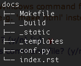
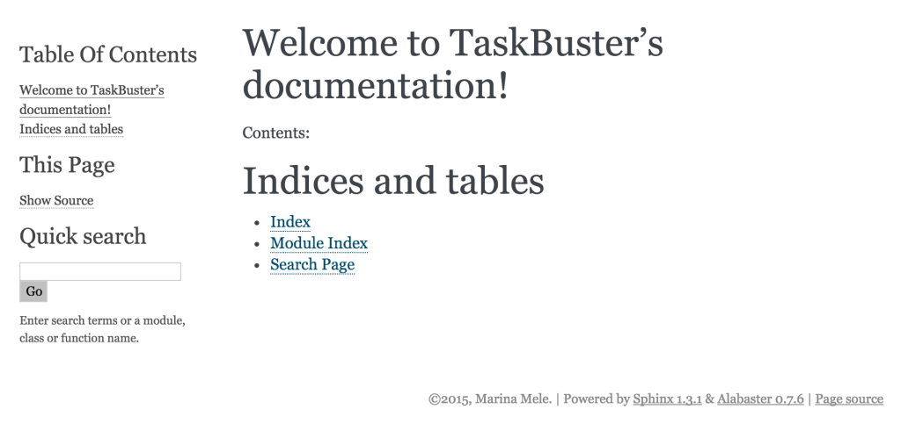

Part VI – Documenting the TaskBuster Django Boilerplate
=======================================================

.. role:: red
.. role:: redbold
.. role:: bolditalic
.. role:: orange
.. |;)| image:: _static/1f609.png
.. |:)| image:: _static/1f642.png

.. |br| raw:: html

    

Next in our tutorial, we’ll talk about documentation. Although I’m sure our
TaskBuster project is documented enough throughout this tutorial |:)|

At this moment, our project has a functional home page that supports
internationalization, localization and time zones.
And it’s completely covered by tests |:)|

However, we have prepared this project with more collaborators in mind.
We want that someone can download what we’ve done so far, and use it as a
Project Template for its own Django project.

Yess! An awesome **Django Project Boilerplate**!!

But we need to document it well, so that anyone who downloads our project
from an online repository has all the information to
install it, configure it, and run it.

Let’s get to work!

The Outline of this part is:

* :ref:`Install-and-configure-Sphinx`
* :ref:`Documenting-the-TaskBuster-Django-Project`
* :ref:`Upload-your-project-on-GitHub`
* :ref:`Upload-your-Docs-on-ReadTheDocs`

We will use
`reStructuredText <http://docutils.sourceforge.net/rst.html>`_
(reST) to write the documentation, a common
markup format. For those of you who worked with LaTeX, is something similar.
You write a plain text file without any special format, like:

.. code-block:: rst

    TaskBuster
    ==========

    Welcome to the TaskBuster Documentation

and then you compile it. The result is a nice html file with a big title
(TaskBuster) and a paragraph (Welcome to the TaskBuster Documentation).
You can see more examples in
`Read The Docs <https://readthedocs.org/>`_, where we will upload our
final documentation for everyone to see |;)|

       Don’t forget to document your Django app!

Another tool that we will use is `Sphinx <http://sphinx-doc.org/>`_,
a python package that takes docstrings of your code files and includes them
inside your docs, automatically!! |:)|

.. _Install-and-configure-Sphinx:

Install and configure Sphinx
----------------------------

As we won’t use the docs in production, install Sphinx only in the developing
environment (and if you want, also in the testing environment).
Activate the virtual environment and type:

.. code-block:: bash

    $ pip install sphinx

Looking at the final message, you’ll see that you also installed
the packages :red:`docutils`, :red:`Jinja2`, :red:`Pygments` and
:red:`markupsafe` (and depending
on your version, also :red:`alabaster`, :red:`babel`,
:red:`six`, :red:`snowballstemmer` and/or
:red:`sphinx-rtd-theme`). You should add them all in the environment’s requirements
file, :red:`requirements/development.txt` (remember to pip freeze to
see the current version).

Go inside the :red:`taskbuster_project` folder to configure Sphinx with:

.. code-block:: bash

    $ sphinx-quickstart

Note: if you have a Mac and see the an error saying
“ValueError: unknown locale: UTF-8”, use this
`solution <http://stackoverflow.com/a/10926115>`_.

next, Sphinx will ask you different questions, and for
each of them you will find the default answer between :orange:`[]`:

.. code-block:: rst

    1. Enter the root path for documentation.
    > Root path for the documentation [.]: ./docs

This creates a :red:`docs` folder inside the :red:`taskbuster_project` folder,
that will contain all the documentation.

.. code-block:: rst

    2. You have two options for placing the build directory for Sphinx output.
    Either, you use a directory “_build” within the root path, or you separate
    “source” and “build” directories within the root path.
    > Separate source and build directories (y/n) [n]: n

    3. Inside the root directory, two more directories will be created; “_templates”
    for custom HTML templates and “_static” for custom stylesheets and other static
    files. You can enter another prefix (such as “.”) to replace the underscore.
    > Name prefix for templates and static dir [_]: _

    4. The project name will occur in several places in the built documentation.
    > Project name: TaskBuster
    > Author name(s): Marina Mele

    5. Sphinx has the notion of a “version” and a “release” for the
    software. Each version can have multiple releases. For example, for
    Python the version is something like 2.5 or 3.0, while the release is
    something like 2.5.1 or 3.0a1.  If you don’t need this dual structure,
    just set both to the same value.
    > Project version: 0.1
    > Project release [1.0]: 0.1.0

This is our first project version, thus the small number :orange:`0.1.0`.
Each time we fix some bug or minor error, we will increase the third number
(:orange:`0.1.0, 0.1.1, 0.1.2`, etc), and each time we add a new functionality,
we will increment the second number (:orange:`0.1.0, 0.2.0, 0.3.0`, etc).

.. code-block:: rst

    6. If the documents are to be written in a language other than English, you can
    select a language here by its language code. Sphinx will then translate text
    that it generates into that language.
    For a list of supported codes, see
    http://sphinx-doc.org/config.html#confval-language
    > Project language [en]: en

    7. The file name suffix for source files. Commonly, this is either “.txt”
    or “.rst”.  Only files with this suffix are considered documents.
    > Source file suffix [.rst]: .rst

    8. One document is special in that it is considered the top node of the
    “contents tree”, that is, it is the root of the hierarchical structure
    of the documents. Normally, this is “index”, but if your “index”
    document is a custom template, you can also set this to another filename.
    > Name of your master document (without suffix) [index]: index

    9. Sphinx can also add configuration for epub output:
    > Do you want to use the epub builder (y/n) [n]: n

Now, we need to indicate the Sphinx extensions we want to add to our
documentation. For now, we will only include :red:`autodoc`, an extension that
looks inside our project files for docstrings and
imports them into the documentation:

.. code-block:: rst

    10. Please indicate if you want to use one of the following Sphinx extensions:
    > autodoc: automatically insert docstrings from modules (y/n) [n]: y
    > doctest: automatically test code snippets in doctest blocks (y/n) [n]: n
    > intersphinx: link between Sphinx documentation of different projects (y/n) [n]: n
    > todo: write “todo” entries that can be shown or hidden on build (y/n) [n]: n
    > coverage: checks for documentation coverage (y/n) [n]: n
    > pngmath: include math, rendered as PNG images (y/n) [n]: n
    > mathjax: include math, rendered in the browser by MathJax (y/n) [n]: n
    > ifconfig: conditional inclusion of content based on config values (y/n) [n]: n
    > viewcode: include links to the source code of documented Python objects (y/n) [n]: n

    11. A Makefile and a Windows command file can be generated for you so that
    you only have to run e.g. ‘make html’ instead of invoking sphinx-build
    directly.
    > Create Makefile? (y/n) [y]: y
    > Create Windows command file? (y/n) [y]: n

If you’re using Windows, answer :orange:`y` to the previous question.

You’ll see that you have a :red:`docs` folder with the structure
shown in the right image.

Next, we need to edit the :red:`conf.py` file. Open it
and after the :orange:`sys` and :orange:`os` imports add the following:

.. code-block:: python

    sys.path.insert(0, os.path.abspath('..'))
    from django.conf import settings
    settings.configure()

Note that we are including the top folder, :red:`taskbuster_project`,
into the :red:`system path`. This will tell Sphinx where it should
look for your project files.

Next, go inside the :red:`docs` folder and type:

.. code-block:: bash

    $ make html

you should see something like

.. code-block:: bash

    build succeeded
    Build finished. The HTML pages are in _build/html.

So go inside the :red:`_build/html` folder, and open the :red:`index.html`
file with your browser. You should see something like:

Yeah, I know it’s quite empty, but we’ll fix that in a minute! |:)|

By the way, it’s a good time for a commit:

.. code-block:: bash

    $ git add .
    $ git status
    $ git commit -m "Sphinx installed and configured"
    $ git push origin master

The last one only if you have a remote repository,
like Bitbucket or Github, with the alias origin.

.. _Documenting-the-TaskBuster-Django-Project:

Documenting the TaskBuster Django Project Boilerplate
-----------------------------------------------------

Inside the docs folder, there is an :red:`index.rst` file that contains
the index of documentation. Let’s edit and add some content!!

.. code-block:: rst

    Welcome to TaskBuster's documentation!
    ======================================

    This is an awesome **Django Project Boilerplate**!!

    With this code you can start a *complex* Django Project
    very quickly, with just a few steps!

    Some of the TaskBuster Django Project Boilerplate functionalities are:

    - **different virtual environments** for developing, testing and production
    - **Internationalization** and **localization** to support different languages
    - Project structure
    - **HTML5 Boilerplate**
    - Template Inheritance
    - Functional **tests**
    - robots.txt and humans.txt configured

    Moreover, you can learn how to create this boilerplate **step by step**
    in the |taskbuster_tutorial|. There you can learn, step by step, how
    TaskBuster has been done, and even do it yourself if you want to!!

    .. |taskbuster_tutorial| raw:: html

        <a href="http://marinamele.com/taskbuster-django-tutorial"
        target="_blank">TaskBuster Django Tutorial</a>

    To start using the Boilerplate, check out the :doc:`requirements`
    and next the :doc:`quick_start`.

    Contents
    --------

    .. toctree::
       :maxdepth: 2

       requirements
       quick_start

    Indices and tables
    ==================

    * :ref:`genindex`
    * :ref:`modindex`
    * :ref:`search`

This file describes the TaskBuster project and then,
after the :red:`toctree` directive, we are including two different files:
:red:`requirements.rst` and :red:`quick_start.rst`, which are not yet created.

Let’s fix that!! Create both files inside the docs folder:

.. code-block:: bash

    $ touch docs/{requirements.rst,quick_start.rst}

The :red:`requirements.rst` file will include all the requirements
necessary to use our Django Project Boilerplate, and
the :red:`quick_start.rst` section will explain how to use and
personalize the Boilerplate (e.g., change the project
name or the translation languages).

These files contain the following:

.. code-block:: rst

    Requirements
    ============

    The requirements necessary to use this Django Project Boilerplate are:

    - **python3** and **pip3**
    - **virtualenv and virtualenvwrapper**
    - **Firefox** (to use Selenium's Webdriver in functional Tests)
    - **GNU gettext** (to use Internationalization)

    If you don't have the first two requirements, you may find this
    post useful: |python_install|.

    .. |python_install| raw:: html

    <a href="http://www.marinamele.com/2014/07/install-python3-on-mac-os-x-and-use-virtualenv-and-virtualenvwrapper.html" target="_blank">Install Python 3 on Mac OS X and use virtualenv and virtualenvwrapper</a>

    You can download Firefox from the official web page: |firefox_web|.

    .. |firefox_web| raw:: html

    <a href="https://www.mozilla.org" target="_blank">Firefox</a>

    And if you don't have GNU gettext, check this |taskbuster_section|.

    .. |taskbuster_section| raw:: html

    <a href="http://marinamele.com/taskbuster-django-tutorial/internationalization-localization-languages-time-zones" target="_blank">TaskBuster tutorial section</a>

    **Ready!?** Continue to the :doc:`quick_start`!

.. code-block:: rst

    Quick Start Guide
    =================

    Download TaskBuster Django Project Boilerplate
    ----------------------------------------------

    First, you need to download the BoilerPlate from GitHub.

    Secret Django Key
    -----------------

    This boilerplate has the **DJANGO_KEY** setting variable hidden.

    You can generate your DJANGO_KEY |django_key|.

    .. |django_key| raw:: html

    <a href="http://www.miniwebtool.com/django-secret-key-generator"
    target="_blank">here</a>

    Project Name
    ------------

    This project is named *TaskBuster*, so if you are using this
    Boilerplate to create your own project, you'll have to change
    the name in a few places:

    - *taskbuster_project* **folder** (your top project container)
    - *taskbuster_project/taskbuster* **folder** (your project name)
    - virtual environment names: **tb_dev** and **tb_test** (name them whatever you want)
    - in virtual environments **postactivate** files (see section below), you have to change **taskbuster.settings.development** for your **projectname.settings.development**. Same works for the testing environment.

    Virtual environments and Settings Files
    ---------------------------------------

    First, you must know your Python 3 path::

    $ which python3

    which is something similar to /usr/local/bin/python3.

    Next, create a Development virtual environment with Python 3 installed::

    $ mkvirtualenv --python=/usr/local/bin/python3 tb_dev

    where you might need to change it with your python path.

    Go to the virtual enviornment folder with::

    $ cd $VIRTUAL_ENV/bin

    and edit the postactivate file.:

    $ vi postactivate

    You must add the lines: ::

    export DJANGO_SETTINGS_MODULE="taskbuster.settings.development"
    export SECRET_KEY="your_secret_django_key"

    with your project name and your own secret key.

    Next, edit the **predeactivate** file and add the line::

    unset SECRET_KEY

    Repeat the last steps for your testing environment::

    $ mkvirtualenv --python=/usr/local/bin/python3 tb_test
    $ cd $VIRTUAL_ENV/bin
    $ vi postactivate

    where you have to add the lines::

    export DJANGO_SETTINGS_MODULE="taskbuster.settings.testing"
    export SECRET_KEY="your_secret_django_key"

    and in the predeactivate file::

    unset SECRET_KEY

    Next, install the packages in each environment::

    $ workon tb_dev
    $ pip install -r requirements/development.txt
    $ workon tb_test
    $ pip install -r requirements/testing.txt

    Internationalization and Localization
    -------------------------------------

    Settings
    ********

    The default language for this Project is **English**, and we use internatinalization to translate the text into Catalan.

    If you want to change the translation language, or include a new one, you just need to modify the **LANGUAGES** variable in the file *settings/base.py*. The language codes that define each language can be found |codes_link|.

    .. |codes_link| raw:: html

    <a href="http://msdn.microsoft.com/en-us/library/ms533052(v=vs.85).aspx" target="_blank">here</a>

    For example, if you want to use German you should include::

    LANGUAGES = (
        ...
        'de', _("German"),
        ...
    )

    You can also specify a dialect, like Luxembourg's German with::

    LANGUAGES = (
        ...
        'de-lu', _("Luxemburg's German"),
        ...
    )

    Note: the name inside the translation function _("") is the language name in the default language (English).

    More information on the |internationalization_post|.

    .. |internationalization_post| raw:: html

    <a href="http://marinamele.com/taskbuster-django-tutorial/internationalization-localization-languages-time-zones" target="_blank">TaskBuster post</a>

    Translation
    ***********

    Go to the terminal, inside the taskbuster_project folder and create the files to translate with::

    $ python manage.py makemessages -l ca

    change the language "ca" for your selected language.

    Next, go to the locale folder of your language::

    $ cd taskbuster/locale/ca/LC_MESSAGES

    where taskbuster is your project folder. You have to edit the file *django.po* and translate the strings. You can find more information about how to translate the strings |translation_strings_post|.

    .. |translation_strings_post| raw:: html

    <a href="http://marinamele.com/taskbuster-django-tutorial/internationalization-localization-languages-time-zones#inter-translation" target="_blank">here</a>

    Once the translation is done, compile your messages with::

    $ python manage.py compilemessages -l ca

    Tests
    *****

    We need to update the languages in our Tests to make sure the translation works correclty. Open the file *functional_tests/test_all_users.py*:

    - in **test_internationalization**, update your languages with the translation of title text, here "Welcome to TaskBuster!"
    - in **test_localization**, update your languages.

    Useful commands
    ---------------

    A list of all the commands used to run this template::

    $ workon tb_dev
    $ workon tb_test

    $ python manage.py makemessages -l ca
    $ python manage.py compilemessages -l ca

Next, run again the html builder to see the changes!

.. code-block:: bash

    $ make html

Did it work?!

.. _Upload-your-project-on-GitHub:

Upload your project on GitHub
-----------------------------

Now that we have our boilerplate ready, we will upload it into
GitHub, so that anyone can download it and use it. However,
two things GitHub recommends to include in a repository are the
files :red:`LICENSE`, :red:`README` and :red:`.gitignore`.

In order to decide which license you want to use for a project on GitHub,
you should read this
`GitHub article <https://help.github.com/articles/open-source-licensing>`_
or the `Choose a license <http://choosealicense.com/>`_ website.

For the TaskBuster Django project boilerplate I will
use the MIT license, and it will be a text file
located in the root directory.

Next we will create the :red:`README.rst` file (also in the root
directory), with a similar content as the :red:`index.rst` file.

We already have the :red:`.gitignore` file |:)|

Once we have these files, we need to create a new repository
on GitHub and get its url
(here, https://github.com/mineta/taskbuster-boilerplate.git).

Next, we add this repository as the github remote:

.. code-block:: bash

    $ git remote add github https://github/mineta/taskbuster-boilerplate.git

note: you can call the remote “origin” instead of “github” if you
want to, but I choose this name to not confuse with
the Bitbucket “origin” remote.

Commit your changes to your local repository:

.. code-block:: bash

    $ git add .
    $ git status
    $ git commit -m "Documentation ready"

and update it into the GitHub repository
(as well as in your private Bitbucket repository):

.. code-block:: bash

    $ git push -u github

Check the
`TaskBuster Boilerplate <https://github.com/mineta/taskbuster-boilerplate>`_
project on GitHub!

.. _Upload-your-Docs-on-ReadTheDocs:

Upload your Docs on ReadTheDocs
-------------------------------

First, create an account in
`ReadTheDocs <https://readthedocs.org/accounts/signup/>`_
if you don’t have one yet.

Next, you can
`connect your GitHub account <https://readthedocs.org/accounts/social/connections/>`_
and import your project’s docs from there.

And you just need to
`import <https://readthedocs.org/dashboard/import/github/sync/>`_
your desired project from GitHub,
and create your docs in ReadTheDocs!

You can see the results `here <http://taskbuster-boilerplate.readthedocs.org/>`_!

What’s next?
------------

Now, you can check or download the full code developed in this tutorial
in the GitHub repository:
`TaskBuster Boilerplate <https://github.com/mineta/taskbuster-boilerplate>`_

Or continue with this tutorial and configure your database.
But which one will you use?

    * `PostgreSQL <http://www.marinamele.com/taskbuster-django-tutorial/install-and-configure-posgresql-for-django>`_ (recommended)
    * `MySQL <http://www.marinamele.com/taskbuster-django-tutorial/install-and-configure-mysql-for-django>`_

That’s all for this part!

Don’t forget to give it a +1 if useful, and share it
with your friends! Thanks! |:)|
